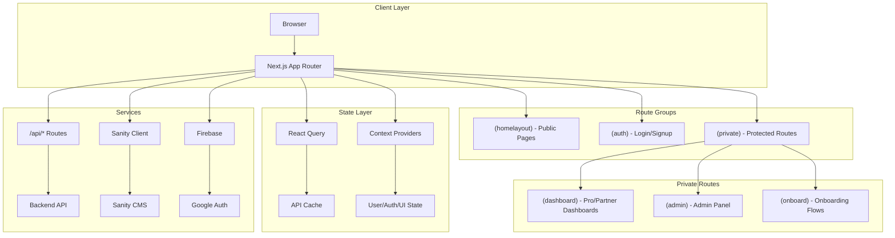
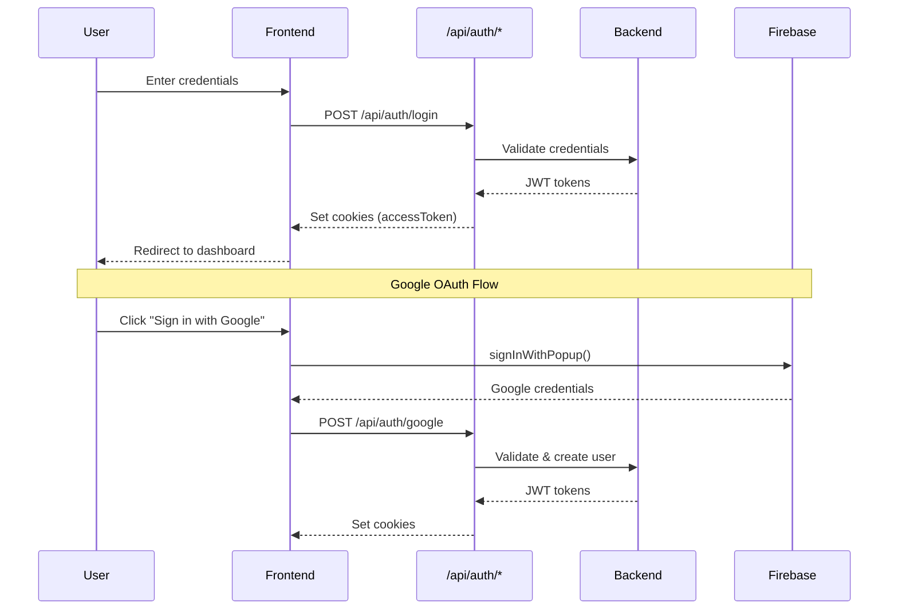
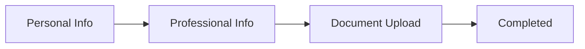

# Horizon-Next Frontend Documentation

> A comprehensive guide to understanding the Wevoro/Horizzon frontend application

---

## Table of Contents

1. [Project Overview](#project-overview)
2. [Technology Stack](#technology-stack)
3. [System Architecture](#system-architecture)
4. [Directory Structure](#directory-structure)
5. [Routing Structure](#routing-structure)
6. [Component Organization](#component-organization)
7. [State Management](#state-management)
8. [Authentication Flow](#authentication-flow)
9. [API Routes](#api-routes)
10. [User Types & Flows](#user-types--flows)
11. [Onboarding Process](#onboarding-process)
12. [Key Features](#key-features)
13. [UI Components Library](#ui-components-library)
14. [Getting Started](#getting-started)

---

## Project Overview

**Horizzon** (also known as Wevoro) is a healthcare job platform that connects:

- **Pros** (Healthcare Professionals looking for jobs)
- **Partners** (Healthcare Organizations/Employers)
- **Admins** (Platform administrators)

The frontend is built with Next.js 14 using the App Router architecture, providing a modern, server-side rendered experience with client-side interactivity.

---

## Technology Stack

| Category             | Technology                           |
| -------------------- | ------------------------------------ |
| **Framework**        | Next.js 14.2.5 (App Router)          |
| **Language**         | TypeScript                           |
| **Styling**          | TailwindCSS                          |
| **UI Components**    | shadcn/ui (Radix UI primitives)      |
| **State Management** | React Context + TanStack React Query |
| **Forms**            | React Hook Form + Zod validation     |
| **Authentication**   | Firebase (Google Auth) + JWT tokens  |
| **CMS**              | Sanity                               |
| **HTTP Client**      | Axios                                |
| **Animations**       | Framer Motion                        |
| **Notifications**    | Sonner (toast notifications)         |
| **Icons**            | Lucide React                         |

---

## System Architecture



---

## Directory Structure

```
horizon-next/
├── app/                          # Next.js App Router
│   ├── (auth)/                   # Authentication routes (login, signup)
│   │   ├── partner/              # Partner auth pages
│   │   └── pro/                  # Pro auth pages
│   ├── (homelayout)/             # Public marketing pages
│   │   ├── about/
│   │   ├── partners/
│   │   ├── pros/
│   │   ├── privacy/
│   │   ├── terms/
│   │   └── conditions/
│   ├── (private)/                # Protected routes (requires auth)
│   │   ├── (admin)/              # Admin panel
│   │   ├── (dashboard)/          # User dashboards
│   │   │   ├── partner/          # Partner dashboard
│   │   │   └── pro/              # Pro dashboard
│   │   └── (onboard)/            # Onboarding flows
│   │       ├── partner/
│   │       └── pro/
│   ├── api/                      # API route handlers
│   │   ├── auth/                 # Auth endpoints
│   │   ├── user/                 # User management
│   │   ├── admin/                # Admin operations
│   │   └── partner-verification/ # Partner verification
│   ├── apiHooks/                 # React Query hooks
│   ├── cms/                      # Sanity CMS routes
│   ├── firebase/                 # Firebase initialization
│   ├── types/                    # TypeScript types
│   ├── layout.tsx                # Root layout
│   ├── globals.css               # Global styles
│   └── middleware.ts             # Route protection
│
├── components/                   # React components
│   ├── auth/                     # Auth-specific components
│   ├── global/                   # Shared/global components
│   │   ├── admin/                # Admin components
│   │   ├── dashboard/            # Dashboard components
│   │   ├── feedback/             # Feedback system
│   │   ├── landing/              # Landing page sections
│   │   └── *.tsx                 # Shared components
│   └── ui/                       # shadcn/ui components
│
├── hooks/                        # Custom React hooks
│   ├── use-mobile.tsx
│   ├── use-toast.ts
│   └── useMediaQuery.tsx
│
├── lib/                          # Core utilities
│   ├── contexts/                 # React Context providers
│   │   ├── admin-context.tsx
│   │   ├── auth-context.tsx
│   │   ├── cookies-context.tsx
│   │   ├── onboard-context.tsx
│   │   ├── ui-context.tsx
│   │   ├── user-context.tsx
│   │   └── index.ts
│   ├── axiosInterceptor.tsx      # Axios configuration
│   ├── provider.tsx              # Root provider wrapper
│   └── utils.ts                  # Utility functions
│
├── utils/                        # Helper utilities
│   ├── auth.tsx                  # Auth utilities
│   ├── constants.tsx             # App constants
│   ├── isAuthenticated.tsx       # Auth check helper
│   └── status.tsx                # Status utilities
│
├── sanity/                       # Sanity CMS configuration
├── public/                       # Static assets
├── middleware.ts                 # Next.js middleware
├── tailwind.config.ts            # Tailwind configuration
└── package.json                  # Dependencies
```

---

## Routing Structure

### Route Groups

Next.js route groups (folders in parentheses) organize routes without affecting the URL:

| Group          | Purpose                       | Requires Auth    |
| -------------- | ----------------------------- | ---------------- |
| `(homelayout)` | Public marketing pages        | No               |
| `(auth)`       | Login, signup, password reset | No               |
| `(private)`    | All protected routes          | Yes              |
| `(dashboard)`  | User dashboards               | Yes              |
| `(admin)`      | Admin panel                   | Yes (Admin role) |
| `(onboard)`    | User onboarding               | Yes              |

### Layout Hierarchy

```
RootLayout (app/layout.tsx)
├── HomeLayout (homelayout/layout.tsx)
│   └── Public pages with navbar/footer
├── AuthLayout (auth/layout.tsx)
│   └── Login/signup pages
└── PrivateLayout (private/layout.tsx)
    ├── DashboardLayout
    │   ├── Partner dashboard routes
    │   └── Pro dashboard routes
    ├── AdminLayout
    │   └── Admin panel routes
    └── OnboardLayout
        └── Onboarding steps
```

### Key Routes

| Route                | Component          | Description                      |
| -------------------- | ------------------ | -------------------------------- |
| `/`                  | Home page          | Landing page with hero, features |
| `/pros`              | For Professionals  | Information for job seekers      |
| `/partners`          | For Partners       | Information for employers        |
| `/pro/login`         | Pro Login          | Healthcare professional login    |
| `/partner/login`     | Partner Login      | Organization login               |
| `/pro/profile`       | Pro Profile        | Job seeker dashboard             |
| `/partner/profile`   | Partner Profile    | Employer dashboard               |
| `/admin`             | Admin Panel        | Platform administration          |
| `/pro/onboard/*`     | Pro Onboarding     | Multi-step registration          |
| `/partner/onboard/*` | Partner Onboarding | Multi-step registration          |

---

## Component Organization

### Component Categories

#### `/components/ui/` - Base UI Components (shadcn/ui)

Reusable primitive components based on Radix UI:

- `button.tsx`, `input.tsx`, `textarea.tsx`
- `dialog.tsx`, `sheet.tsx`, `popover.tsx`
- `select.tsx`, `checkbox.tsx`, `form.tsx`
- `table.tsx`, `tabs.tsx`, `accordion.tsx`
- `toast.tsx`, `tooltip.tsx`, `avatar.tsx`
- `dropdown-menu.tsx`, `command.tsx`
- `carousel.tsx`, `scroll-area.tsx`
- And more (30 total components)

#### `/components/global/` - Shared Components

Feature components used across the application:

| Subdirectory | Purpose                | Key Components                                                                  |
| ------------ | ---------------------- | ------------------------------------------------------------------------------- |
| `admin/`     | Admin panel components | `data-table.tsx`, `columns.tsx`, `admin-sidebar.tsx`, `chart.tsx`               |
| `dashboard/` | Dashboard components   | `dashboard-layout.tsx`, `dashboard-nav.tsx`, `documents.tsx`, `offer-lists.tsx` |
| `landing/`   | Landing page sections  | `banner.tsx`, `features.tsx`, `testimonial.tsx`, `footer.tsx`                   |
| `feedback/`  | Feedback system        | `floating-feedback.tsx`                                                         |

**Root-level global components:**

- `navbar.tsx` - Main navigation bar
- `logo.tsx` - Application logo
- `loading.tsx` - Loading spinner
- `onboard-*.tsx` - Onboarding step components
- `pro-login.tsx`, `partner-login.tsx` - Auth forms

#### `/components/auth/` - Authentication Components

Login and signup form components specific to auth flows.

---

## State Management

### Provider Hierarchy

The app wraps state providers in `lib/provider.tsx`:

```tsx
<QueryClientProvider>
  {' '}
  {/* TanStack React Query */}
  <UserProvider>
    {' '}
    {/* Current user data */}
    <AdminProvider>
      {' '}
      {/* Admin-specific state */}
      <AuthProvider>
        {' '}
        {/* Auth actions & state */}
        <UIProvider>
          {' '}
          {/* UI state (modals, etc) */}
          <OnboardProvider>
            {/* Onboarding progress */}
            <CookiesProvider>{children}</CookiesProvider>
          </OnboardProvider>
        </UIProvider>
      </AuthProvider>
    </AdminProvider>
  </UserProvider>
</QueryClientProvider>
```

### Context Details

| Context            | File                  | Purpose           | Key Values                                                         |
| ------------------ | --------------------- | ----------------- | ------------------------------------------------------------------ |
| **UserContext**    | `user-context.tsx`    | Current user data | `user`, `refetchUser()`                                            |
| **AuthContext**    | `auth-context.tsx`    | Authentication    | `handleLogin()`, `handleSignup()`, `logOut()`, `logInWithGoogle()` |
| **AdminContext**   | `admin-context.tsx`   | Admin operations  | Admin-specific state and actions                                   |
| **UIContext**      | `ui-context.tsx`      | UI state          | Modal states, loading indicators                                   |
| **OnboardContext** | `onboard-context.tsx` | Onboarding        | Step progress, form data                                           |
| **CookiesContext** | `cookies-context.tsx` | Cookie consent    | Cookie preferences                                                 |

### TanStack React Query

Used for server state management with:

- 60-second default stale time
- Automatic background refetching
- Cache invalidation patterns

```typescript
// Example hook usage (app/apiHooks/)
const { data, isLoading, refetch } = useQuery({
  queryKey: ['offers'],
  queryFn: fetchOffers,
});
```

---

## Authentication Flow

### Overview



### Middleware Protection

`middleware.ts` protects routes based on authentication:

```typescript
// Protected route patterns
const protectedRoutes = [
  /^\/pro\/onboard\/(personal-info|professional-info|document-upload|completed)$/,
  /^\/pro\/(profile|offers|jobs|notifications|settings)$/,
  /^\/partner\/(profile|pros|offers|notifications|settings)$/,
  /^\/admin.*/,
];
```

### Auth Actions (AuthContext)

| Method                                     | Purpose                    |
| ------------------------------------------ | -------------------------- |
| `handleLogin(data, source)`                | Email/password login       |
| `handleSignup(data, source)`               | New user registration      |
| `handleForgotPassword(data, source)`       | Request password reset OTP |
| `handleVerifyOTP(otp, email, source)`      | Verify OTP code            |
| `handleResetPassword(data, email, source)` | Set new password           |
| `logInWithGoogle()`                        | Google OAuth popup         |
| `logOut()`                                 | Clear session and redirect |
| `deleteAccount()`                          | Delete user account        |

---

## API Routes

### Internal API Endpoints (`/app/api/`)

| Endpoint                             | Methods   | Purpose                  |
| ------------------------------------ | --------- | ------------------------ |
| `/api/auth/login`                    | POST      | User login               |
| `/api/auth/signup`                   | POST      | User registration        |
| `/api/auth/forgot-password`          | POST      | Password reset request   |
| `/api/auth/verify-otp`               | POST      | OTP verification         |
| `/api/auth/reset-password`           | POST      | Password update          |
| `/api/user/personal-information`     | GET, POST | User profile data        |
| `/api/user/professional-information` | GET, POST | Professional details     |
| `/api/user/document-upload`          | POST      | Upload documents         |
| `/api/user/document-delete`          | DELETE    | Remove documents         |
| `/api/user/offer/*`                  | CRUD      | Offer management         |
| `/api/user/notification/*`           | GET, POST | Notifications            |
| `/api/user/feedback`                 | POST      | Submit feedback          |
| `/api/user/autofill`                 | POST      | AI-powered form autofill |
| `/api/admin/*`                       | Various   | Admin operations         |
| `/api/partner-verification`          | POST      | Partner verification     |

### API Pattern

Routes follow Next.js App Router convention:

```typescript
// app/api/user/profile/route.ts
export async function GET(req: NextRequest) {
  // Handle GET request
}

export async function POST(req: NextRequest) {
  // Handle POST request
}
```

---

## User Types & Flows

### Pro (Healthcare Professional)

**Journey:**

1. Sign up → `/pro/signup`
2. Login → `/pro/login`
3. Onboarding → `/pro/onboard/*`
4. Dashboard → `/pro/profile`

**Dashboard Features:**

- Profile management
- Job browsing and applications
- Offer management
- Document uploads
- Notifications
- Settings

### Partner (Healthcare Organization)

**Journey:**

1. Sign up → `/partner/signup`
2. Login → `/partner/login`
3. Onboarding → `/partner/onboard/*`
4. Verification → Partner verification process
5. Dashboard → `/partner/profile`

**Dashboard Features:**

- Organization profile
- Pro search and browsing
- Offer creation and management
- Onboarding management
- Notifications
- Settings

### Admin

**Journey:**

1. Login → `/admin/login`
2. Dashboard → `/admin`

**Dashboard Features:**

- Overview with charts
- Pro management (data table)
- Partner management
- Application review
- Feedback management
- User messaging

---

## Onboarding Process

### Pro Onboarding Flow



| Step | Route                            | Component                       | Description                        |
| ---- | -------------------------------- | ------------------------------- | ---------------------------------- |
| 1    | `/pro/onboard/personal-info`     | `onboard-personal-info.tsx`     | Name, contact, location            |
| 2    | `/pro/onboard/professional-info` | `onboard-professional-info.tsx` | Skills, experience, certifications |
| 3    | `/pro/onboard/document-upload`   | `onboard-document-upload.tsx`   | Upload required documents          |
| 4    | `/pro/onboard/completed`         | Completion page                 | Success confirmation               |

### Partner Onboarding Flow

| Step | Route                            | Description                     |
| ---- | -------------------------------- | ------------------------------- |
| 1    | `/partner/onboard/personal-info` | Organization details            |
| 2    | Partner verification             | Document verification process   |
| 3    | Dashboard access                 | Access to full partner features |

### Autofill Feature

The app provides an AI-powered autofill feature (`/api/user/autofill`) that can automatically populate form fields from uploaded documents like resumes.

---

## Key Features

### 1. Dashboard System

- **Role-based layouts** - Different dashboards for Pro, Partner, Admin
- **Dashboard navigation** - Sidebar navigation with role-specific menu items
- **Profile management** - Edit personal and professional information

### 2. Document Management

- **Upload system** - Support for multiple document types
- **Document viewer** - In-app document preview
- **Document categories** - Organized by type (ID, certifications, etc.)

### 3. Offers System

- **Offer creation** - Partners can create job offers
- **Offer management** - Accept, reject, counter offers
- **Offer notifications** - Real-time notifications for offer updates

### 4. Notification System

- **In-app notifications** - Bell icon with notification list
- **Toast notifications** - Sonner for transient messages
- **Notification API** - Full CRUD for notification management

### 5. Admin Panel

- **Data tables** - Sortable, filterable tables for Pro/Partner lists
- **Charts** - Analytics using Recharts
- **Application review** - Review and approve/reject user applications
- **Messaging** - Send messages to users

### 6. Feedback System

- **Floating feedback button** - Always accessible feedback option
- **Feedback modal** - Structured feedback submission
- **Admin feedback view** - Review and manage user feedback

---

## UI Components Library

### Available shadcn/ui Components

| Component     | File                | Usage                              |
| ------------- | ------------------- | ---------------------------------- |
| Accordion     | `accordion.tsx`     | Collapsible content sections       |
| Alert Dialog  | `alert-dialog.tsx`  | Confirmation dialogs               |
| Avatar        | `avatar.tsx`        | User profile images                |
| Button        | `button.tsx`        | Action buttons (multiple variants) |
| Card          | `card.tsx`          | Content containers                 |
| Carousel      | `carousel.tsx`      | Image/content carousels            |
| Checkbox      | `checkbox.tsx`      | Boolean inputs                     |
| Command       | `command.tsx`       | Command palette/search             |
| Dialog        | `dialog.tsx`        | Modal dialogs                      |
| Dropdown Menu | `dropdown-menu.tsx` | Context menus                      |
| Form          | `form.tsx`          | React Hook Form integration        |
| Hover Card    | `hover-card.tsx`    | Hover-triggered cards              |
| Input         | `input.tsx`         | Text inputs                        |
| Input OTP     | `input-otp.tsx`     | OTP code input                     |
| Label         | `label.tsx`         | Form labels                        |
| Phone Input   | `phone-input.tsx`   | International phone input          |
| Popover       | `popover.tsx`       | Floating content                   |
| Scroll Area   | `scroll-area.tsx`   | Custom scrollbars                  |
| Select        | `select.tsx`        | Dropdown selects                   |
| Separator     | `separator.tsx`     | Visual dividers                    |
| Sheet         | `sheet.tsx`         | Slide-out panels                   |
| Sidebar       | `sidebar.tsx`       | Navigation sidebars                |
| Skeleton      | `skeleton.tsx`      | Loading placeholders               |
| Table         | `table.tsx`         | Data tables                        |
| Tabs          | `tabs.tsx`          | Tab navigation                     |
| Textarea      | `textarea.tsx`      | Multi-line inputs                  |
| Toast         | `toast.tsx`         | Toast notifications                |
| Tooltip       | `tooltip.tsx`       | Hover tooltips                     |

---

## Getting Started

### Prerequisites

- Node.js 18+
- npm or pnpm

### Installation

```bash
# Clone the repository
git clone <repository-url>

# Navigate to frontend directory
cd horizon-next

# Install dependencies
npm install

# Set up environment variables
cp .env.example .env.local
# Edit .env.local with your configuration
```

### Environment Variables

Create `.env.local` with:

```env
# Backend API URL
NEXT_PUBLIC_API_URL=<backend-url>

# Firebase Configuration
NEXT_PUBLIC_FIREBASE_API_KEY=
NEXT_PUBLIC_FIREBASE_AUTH_DOMAIN=
NEXT_PUBLIC_FIREBASE_PROJECT_ID=

# Sanity Configuration
NEXT_PUBLIC_SANITY_PROJECT_ID=
NEXT_PUBLIC_SANITY_DATASET=
```

### Development

```bash
# Start development server (port 3002)
npm run dev

# Build for production
npm run build

# Start production server
npm start

# Lint code
npm run lint
```

### Key Configuration Files

| File                 | Purpose                    |
| -------------------- | -------------------------- |
| `next.config.mjs`    | Next.js configuration      |
| `tailwind.config.ts` | Tailwind CSS customization |
| `tsconfig.json`      | TypeScript configuration   |
| `components.json`    | shadcn/ui configuration    |
| `sanity.config.ts`   | Sanity CMS configuration   |

---

## Additional Resources

- [Next.js Documentation](https://nextjs.org/docs)
- [TailwindCSS Documentation](https://tailwindcss.com/docs)
- [shadcn/ui Components](https://ui.shadcn.com/)
- [TanStack Query](https://tanstack.com/query)
- [React Hook Form](https://react-hook-form.com/)
- [Sanity CMS](https://www.sanity.io/docs)

---

_Last updated: February 2026_
